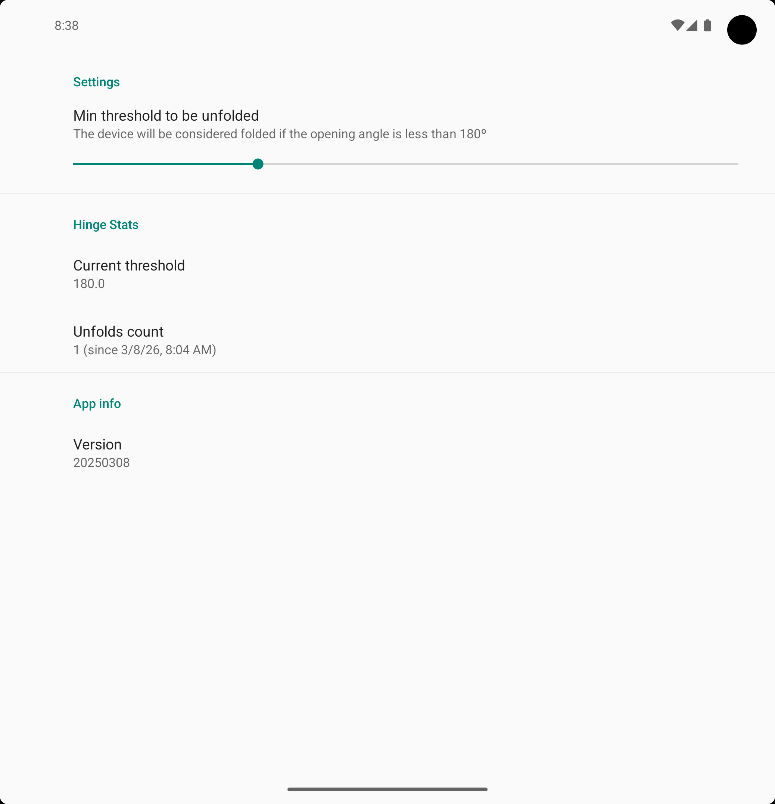

# Folds

Folds is an Android app that tracks the number of times a foldable phone is opened or closed.

It features a home screen widget that displays the fold count and ensures continuous tracking,
even after a device restart. Built with Kotlin, and optimized for foldable devices with hinge sensor.

The reasons are obvious to do a count: Maintenance and Durability.

Some brands specify an estimated number of folds before potential mechanical issues arise (e.g., 200,000 folds).

# APK Certificate signature

The SHA-256 digest of the certificate used to sign the app is as follows, and remains constant regardless of the version:

e6994859709275747cc9f9ed76f089beaec53554287d68f36b56ee0d74c7ce5d

The app signature certification can be checked by the following command:

apksigner verify --verbose --print-certs app-release.apk | grep "Signer #1 certificate SHA-256 digest"

